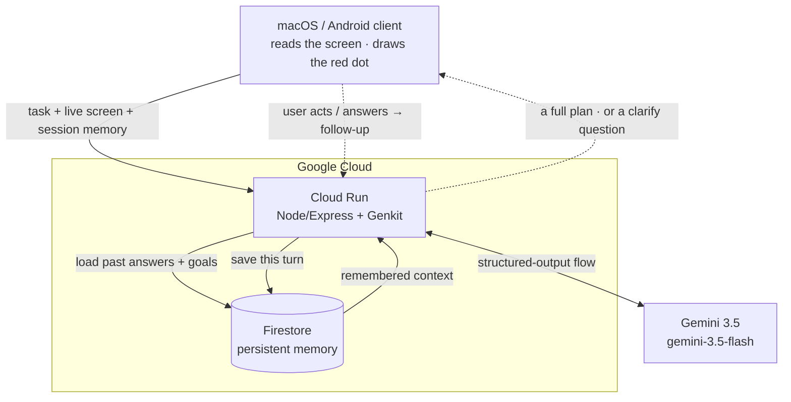

<div align="center">

# 🔴 Waylo Agent — the Collaborative Partner brain

**An agentic backend that guides a person through any task on their phone/computer — one step at a time, asking when it's unsure, and remembering what they told it across sessions.**

[](https://ai.google.dev)
[](https://genkit.dev)
[](https://cloud.google.com/run)
[](https://firebase.google.com/docs/firestore)

**Built for the All Things Agentic Hackathon · Track: The Collaborative Partner**

**Live:** `https://waylo-agent-506434766076.asia-south1.run.app`

</div>


Waylo Agent is the brain for [Waylo](https://github.com/waylo-1) — the app that puts a talking red dot on the exact thing to tap next, teaching elderly and first-time users to use any app. Instead of a fixed script, it **plans each task with Gemini 3.5, grounded in the live screen**, and guides the user one dot at a time — and it **collaborates**: it asks a clarifying question when the goal is ambiguous, it **never dead-ends** (when a task finishes it asks for a follow-up and carries what you just did into the next plan), and it **remembers across sessions** so it never starts from zero.

---

## What was built for this hackathon (disclosure)

Per the **New Projects Only** rule, here is the exact boundary of what was created during the Submission Period (Aug 3–31, 2026):

**Built during the Submission Period — this repo (`waylo_agent`) and the client's `agent-cloud-demo` branch:**
- The entire **agent backend**: the **Genkit + Gemini 3.5** desktop planner (`planFlow`, `services/agent.js`), the **clarifying-question** flow, and the per-turn agent (`/agent/next`).
- The **orchestration**: the follow-up session loop that never dead-ends, clarify handling, and session memory that carries prior tasks into each follow-up plan.
- **Firestore** persistence (`services/memory.js`) and the **Google Cloud Run** deployment.
- The macOS client's **agent wiring** — Follow-up mode, the clarify UI, Right-⌘ voice / typed feedback capture — on the `agent-cloud-demo` branch.

**Pre-existing components carried in (built before Aug 3, 2026), named as such:**
- The macOS / Android **client shell** (window, notch panel, the talking red-dot overlay).
- The **on-device detection pipeline** (L0 Accessibility, L1 OCR, L2 / L2.5 YOLO) that turns a planned step into exact pixel coordinates.

**Standard tools / frameworks:** Genkit, Google GenAI SDK, Express, SwiftUI / AppKit.

The new agent layer lives in this **dedicated repository, created within the Submission Period**, so its commit history reflects the timeline. The pre-existing detection pipeline and learned-icon store remain on the original backend; what this hackathon added is the agentic brain, memory, and deployment above.

---

## What makes it an agent (and a *partner*)

A live loop, not a fixed script: **perceive → reason → act → verify → adapt** — plus **ask** and **remember**.



The desktop client sends `POST /plan` with the task, a live screen snapshot, and the session's memory; **Genkit + Gemini 3.5** return a full step-by-step plan — or a **clarify** question when the goal is genuinely ambiguous. The guide never dead-ends: after a task it asks for a follow-up, and prior tasks are carried into the next plan as context. A per-turn variant, `POST /agent/next`, returns one decision at a time (`continue / done / recover / clarify`) and persists answers to **Firestore**, so a new session inherits what the user already told it.

## Hackathon requirements — how this repo meets them

| Requirement | How |
| --- | --- |
| **Gemini 3.5+** | `gemini-3.5-flash` via the **Gemini API** — powers every plan and every agent decision |
| **Google Agent Framework** | **Genkit** — `services/agent.js` defines two flows with **structured output**: `planFlow` (`/plan`, a full step-by-step plan) and `nextStepFlow` (`/agent/next`, one decision at a time) |
| **Google Cloud service** | **Cloud Run** (hosts the container) **+ Firestore** (persistent memory) — two Google Cloud services |

### How the Google Cloud pieces fit together

- **Cloud Run** runs the whole agent as a serverless container (Node/Express + Genkit). It scales to zero when idle, spins up on demand, and holds up under real traffic — the live service is the URL above.
- **Genkit** is the agent framework. Each request is a Genkit flow (`ai.defineFlow`) that calls **Gemini 3.5** with a Zod **output schema**, so the model is forced to return exactly the JSON the client needs — no brittle text-parsing.
- **Gemini 3.5** (`gemini-3.5-flash`, Gemini API) is the reasoning: it reads the live screen, writes the plan, decides `continue / done / recover / clarify`, and grounds hard cases in the pixels.
- **Firestore** is the persistent, per-user memory — clarify answers and goals are saved and loaded back, so the agent never asks the same thing twice across sessions.

**Request path:** client → `POST /plan` with `{ task, live screen, session memory }` → **Genkit + Gemini 3.5** on **Cloud Run** return a structured plan (or a clarifying question) → the client draws the red dot; persistent answers load/save from **Firestore**.

## The agent flow

`services/agent.js` is the brain: a Genkit `defineFlow` whose **structured output** forces Gemini to return exactly this decision — no fence-stripping, no chatty text:

```json
{
  "status": "continue | done | recover | clarify",
  "reasoning": "one short sentence",
  "action": {
    "instruction": "spoken step, e.g. \"Tap Notifications in the middle of the screen.\"",
    "findDescription": "rich text for on-device element search",
    "elementType": "LIST_ITEM",
    "screenRegion": "center",
    "visualDescription": "...",
    "alternateLabels": ["..."],
    "fallbackHint": "..."
  },
  "question": {
    "prompt": "Would you like to create a new document, or open an existing one?",
    "options": ["Create a new document", "Open an existing one"]
  }
}
```
`action` is null when `status` is `done` or `clarify`; `question` is present only when `status` is `clarify`.

## Persistent memory (Firestore)

Memory works at two levels:

- **Within a session** — the desktop follow-up loop carries the tasks already done into the next `/plan` call as `sessionContext`, so a follow-up like *"now make it bigger"* builds on what you just did instead of starting over.
- **Across sessions** — `services/memory.js` stores, per `userId`, the answers given to clarifying questions and the goals pursued in **Firestore**. On every `/agent/next` that memory is loaded and merged in, so **a brand-new session inherits what the user already told the agent and never re-asks.** Degrades to stateless if Firestore is absent (auto-enabled on Cloud Run via `K_SERVICE`).

## API

| Endpoint | Purpose |
| --- | --- |
| `POST /plan` | **The desktop planner (primary).** `{ task, platform:"macos", screenContext?, sessionContext? }` → a full `{ task, app, steps[] }` plan **or** `{ clarify: { prompt, options } }` — via Genkit `planFlow` + Gemini 3.5. This is what the macOS client calls. |
| `POST /agent/next` | **Per-turn agent.** `{ goal, appName?, screen?, userId?, history?, answers? }` → one decision (`continue / done / recover / clarify`, plus `memoryUsed`) via `nextStepFlow`, with Firestore memory. |
| `GET /health` | Liveness |

Smoke-test the primary planner (Genkit + Gemini 3.5):
```bash
curl -s -X POST https://waylo-agent-506434766076.asia-south1.run.app/plan \
  -H 'Content-Type: application/json' \
  -d '{"task":"make the text bold in Pages","platform":"macos"}'
```

## Run it locally
```bash
npm install
AI_PROVIDER=gemini GEMINI_API_KEY=YOUR_KEY node index.js   # http://localhost:3000
# then: curl -s localhost:3000/health
```
`PORT` overrides the port (Cloud Run sets it to 8080). Firestore stays off locally unless you set `ENABLE_FIRESTORE=1` (with GCP credentials); the `/plan` planner works without it.

## Deploy to Google Cloud Run
```bash
gcloud services enable run.googleapis.com cloudbuild.googleapis.com artifactregistry.googleapis.com firestore.googleapis.com
gcloud firestore databases create --location=asia-south1                       # one-time
gcloud run deploy waylo-agent --source . --region asia-south1 --allow-unauthenticated --memory 512Mi \
  --set-env-vars AI_PROVIDER=gemini,GEMINI_TEXT_MODEL=gemini-3.5-flash,GEMINI_VISION_MODEL=gemini-3.5-flash,GEMINI_API_KEY=YOUR_KEY
```
Builds the Dockerfile on Cloud Build (no local Docker). On Cloud Run, Firestore auto-enables via `K_SERVICE` and uses the service account's default credentials.

## Environment
| Variable | Purpose |
| --- | --- |
| `GEMINI_API_KEY` | Gemini 3.5 key from [AI Studio](https://aistudio.google.com/apikey) — **required** |
| `AI_PROVIDER` | `gemini` |
| `GEMINI_TEXT_MODEL` | `gemini-3.5-flash` |
| `FIRESTORE_COLLECTION` | memory collection (default `waylo_memory`) |
| `ENABLE_FIRESTORE` | `1` to use Firestore off Cloud Run |

## Layout
```
services/agent.js       Genkit flows — planFlow (/plan) + nextStepFlow (/agent/next) + Gemini 3.5 + schemas (incl. clarify)
services/promptSpecs.js  the proven desktop planner prompt + parser (reused by planFlow)
services/memory.js       Firestore persistent cross-session memory
demoPlans.js             locked, curated plans for scripted demo tasks
index.js                 Express app — POST /plan, POST /agent/next, GET /health
Dockerfile               Cloud Run container (node:20-slim)
```

The macOS and Android clients (this hackathon's agent wiring) live in [waylo-1/waylo-agent-client](https://github.com/waylo-1/waylo-agent-client).

---

<div align="center">

**Part of [Waylo](https://github.com/waylo-1)** · Gemini 3.5 · Genkit · Cloud Run · Firestore

</div>
